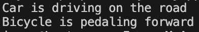

# Liskov-substitution-principle

Принцип підстановки Лісков - об'єкти базового класу повинні замінюватися об'єктами похідних класів без порушення роботи програми.

Як працює код:
- Є базовий клас Vehicle з методом Move.
- Car і Bicycle успадковують його та реалізують рух по-своєму.
- У Main можна створити Vehicle, але присвоїти йому Car або Bicycle – програма працює правильно.

Це означає, що похідні класи можна підставити замість базового без поломок.
## Код
```csharp
using System;

abstract class Vehicle
{
    public abstract void Move();
}

class Car : Vehicle
{
    public override void Move() => Console.WriteLine("Car is driving on the road");
}

class Bicycle : Vehicle
{
    public override void Move() => Console.WriteLine("Bicycle is pedaling forward");
}

class Program
{
    static void Main()
    {
        Vehicle v1 = new Car();
        Vehicle v2 = new Bicycle();

        v1.Move();
        v2.Move();
    }
}
```
## Результат

